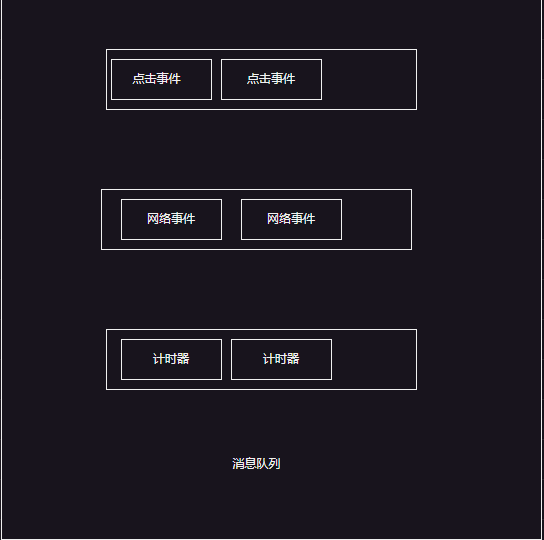
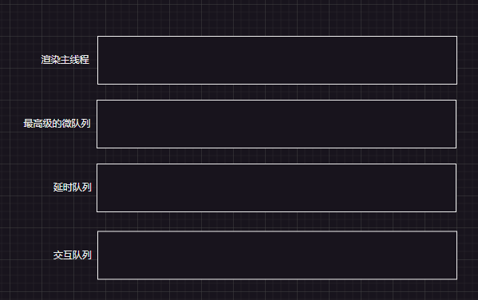

# 事件循环

## 浏览器的进程模型

### 何为进程？

程序运行需要有它自己**专属**的**内存空间**，可以把这块内存空间简单的理解为进程,每一个应用至少有一个进程。**进程之间相互独立**，假设要通信,也需要双方同意


### 何为线程？

简单点说就是有了进程以后才可以运行代码 运行的代码就是线程，**一个进程至少有一个线程**，
所以在进程开启后会自动创建一个线程来运行代码，该线程称之为主线程。如果程序需要同时执行多块代码，主线程就会启动更多的线程来执行代码，所以一个进程中可以包含多个线程。(主线程结束了整个程序就结束了)


### 浏览器有哪些进程和线程？

**浏览器是一个多进程多线程的应用程序**浏览器内部工作极其复杂（复杂程度堪比操作系统）。为了避免相互影响，为了减少连环崩溃的几率，当启动浏览器后，它会自动启动多个进程。


> 浏览器的任务管理器可以查看当前的所有进程

#### 核心进程

1. 浏览器进程：主要负责界面显示（浏览器页面，前进、后退、标签页样子、导航栏）、用户交互（鼠标点击、滑动）、（最开始由浏览器进程开始，然后马上启动其他进程）子进程管理等。浏览器进程内部会启动多个线程处理不同的任务。

2. 网络进程:负责加载网络资源。网络进程内部会启动多个线程来处理不同的网络任务。

3. 渲染进程（本节课重点讲解的进程）渲染进程启动后，会开启一个**渲染主线程**，主线程负责执行 HTML、CSS、JS 代码。默认情况下，浏览器会为每个标签页开启一个新的渲染进程，以保证不同的标签页之间不相互影响。

## 渲染主线程是如何工作的？

- 解析 HTML
- 解析 CSS
- 计算样式
- 布局
- 处理图层
- 每秒把页面画 60 次 FPS
- 执行全局 JS 代码
- 执行事件处理函数
- 执行计时器的回调函数

::: warning
渲染进程为什么不适用多个线程来处理这些事情?

:::


> 注意这里渲染主线程的任务是指执行js代码

1. 初始化的时候 渲染主线程会进入一个无线循环
2. 每一次循环会检查消息队列中是否有任务存在，如果有就取出第一个执行。执行完第一个后进入下一个循环，如果没有就休眠。
3. 其他所有线程（包括其他进程的线程）可以随时向**消息队列**添加任务。新任务会加到消息队列的**末尾**。在添加新任务时，如果**主线程是休眠状态**，则会将其唤醒以继续循环拿取任务

这里解释一下渲染主线程和消息队列之间的关系：

渲染主线程会不断地从消息队列中取出任务并执行，当渲染主线程空闲时，它会检查消息队列中是否有待处理的任务。如果有，它会按照顺序执行这些任务。
由于JavaScript是单线程执行的，所以在任何时候，渲染主线程只能执行一个任务。这意味着，如果有多个任务在消息队列中等待处理，它们会按照顺序逐个执行，而不是同时执行。这种机制使得JavaScript代码的执行顺序可预测，避免了多线程带来的潜在问题。然而，这也意味着，如果一个任务执行时间过长，它可能会阻塞后续任务的执行，导致页面响应不灵敏。为了解决这个问题，开发者可以使用异步编程技术（如setTimeout、Promise、async/await等）来将耗时任务拆分为多个较小的任务，从而避免阻塞渲染主线程。

## 若干解释

### 何为异步？

代码执行过程中一些无法立即处理的任务

- 计时完成后需要执行的任务 (setTimeout、setInterval)
- 网络请求完成后需要执行的任务 (XHR、 Fetch)
- 用户交互完成后需要执行的任务 (addEventListener)


**渲染主线程承担着极其重要的工作，无论如何都不能阻塞！**

因此，浏览器选择**异步**来解决这个问题


使用异步的方式，**渲染主线程永不阻塞**

::: info 面试题：如何理解 JS 的异步？

JS是一门单线程的语言，这是因为它运行在浏览器的渲染主线程中，而渲染主线程只有一个。
而渲染主线程承担着诸多的工作，渲染页面、执行 JS 都在其中运行。
如果使用同步的方式，就极有可能导致主线程产生阻塞，从而导致消息队列中的很多其他任务无法得到执行。这样一来，一方面会导致繁忙的主线程白白的消耗时间，另一方面导致页面无法及时更新，给用户造成卡死现象。

 所以浏览器采用异步的方式来避免。具体做法是当某些任务发生时，比如计时器、网络、事件监听，主线程将任务交给其他线程去处理，自身立即结束任务的执行，转而执行后续代码。当其他线程完成时，将事先传递的**回调函数包装成任务**，加入到消息队列的末尾排队，等待主线程调度执行。

 在这种异步模式下，浏览器永不阻塞，从而最大限度的保证了单线程的流畅运行。

:::

### JS为何会阻碍渲染？

```html

<!DOCTYPE html>
<html lang="en">

<head></head>

<body>
    <h1>Mr.Yuan is awesome!</h1>
    <button>change</button>
    <script>
        var h1 = document.querySelector('h1');
        var btn = document.querySelector('button');

        // 死循环指定的时间
        function delay(duration) {
            var start = Date.now();
            while (Date.now() - start < duration) { }
        }

        btn.onclick = function () {
            h1.textContent = '袁老师很帅！';
            delay(3000);
        };
    </script>
</body>

</html>

```

这段代码会发生什么？

首先第一个执行获取document的对象。当所有代码运行完成以后，这时候页面呈现Mr.Yuan is awesome!。 意味着消息队列 和渲染进程， 已经没有任务执行。当用户点击click事件以后这时候交换进程 就会触发，生成一个函数放入消息队列中，渲染进程就会拿到消息队列中的任务执行。当执行到h1.textContent = '袁老师很帅！'时候触发了新绘制并放入消息队列中，delay在执行过程中阻塞了渲染进程，导致三秒后h1.textContent = '袁老师很帅！';

### 任务有优先级吗？

任务没有优先级，但是任务执行顺序是有优先级的。就是消息队列先进先出

每个任务都有任务裂隙，同一个类型必须在一个队列，不同类型任务可以分属于不同的队列，在一次事件循环中，浏览器可以根据实际情况从不同的队列出去任务执行，微队列的优先级最高。

解释：<https://html.spec.whatwg.org/>




W3C最新中不在使用宏队列的说法。

在目前 chrome 的实现中，至少包含了下面的队列：

- 延时队列：用于存放计时器到达后的回调任务，优先级「中」
- 交互队列：用于存放用户操作后产生的事件处理任务，优先级「高」（改变窗口大小 滚动条 鼠标事件 键盘事件）
- 微队列：用户存放需要最快执行的任务，优先级「最高」，Promise.then()、MutationObserver、setImmediate()、requestIdleCallback()



- 案例1

```js

setTimeout(function () {
    console.log(1);
}, 0);

console.log(2);

//  结果:2,1 
```

 **原因**: 首先渲染主线程会执行全局的js 发现有一个计时器 这时候通知计时线程0秒执行，这时候计时线程会把函数放入延时队列中，接下来渲染主线继续执行console.log(2),渲染主线程执行完成，从消息队列中延时队列取出延时队列中的内容，执行函数，打印1

- 案例2

```js

// 死循环指定的时间
function delay(duration) {
  var start = Date.now();
  while (Date.now() - start < duration) {}
}

setTimeout(function () {
  console.log(1);
}, 0);

delay(3000);

console.log(2);

//  结果:2,1 
```

 **原因**: 首先渲染主线程会执行全局的js 发现有一个计时器 这时候通知计时线程0秒执行，这时候计时线程会把函数放入延时队列中，接下来渲染函数delay执行，渲染主线程执行三秒以后打印2,然后全局执行完毕 这时候去延时队列中取出延时队列中的内容，执行函数，打印1

- 案例3

```js

setTimeout(function () {
    console.log(1);
}, 0);

Promise.resolve().then(function () {
  console.log(2);
});

console.log(3);

//  结果:3，2,1 
```

 **原因**: 首先渲染主线程会执行全局的js 发现有一个计时器 这时候通知计时线程0秒执行，这时候计时线程会把函数放入延时队列中，接下来执行Promise放入微队列中。最后执行console.log(3),然后全局执行完毕 这时候去延时队列中取出微队列中的内容，执行函数，打印2 在取出延时队列中的内容1

- 案例4

```js

function a() {
  console.log(1);
  Promise.resolve().then(function () {
    console.log(2);
  });
}

setTimeout(function () {
  console.log(3);
Promise.resolve().then(a);
}, 0);

Promise.resolve().then(function () {
    console.log(4);
});


console.log(5);

//  结果:5,4,3,1,2  
```

**原因**: 渲染主线程->全局->加入延时队列->加入微队列->执行log(5)->输出5;渲染主线程->拿微队列任务->输出4;渲染主线程->拿延时队列任务->输出3->加入微队列;渲染主线程->拿微队列任务->输出1->加入微队列;渲染主线程->拿微队列任务->输出2;

- 案例5

```js
function a() {
  console.log(1);
  Promise.resolve().then(function () {
    console.log(2);
  });
}
setTimeout(function () {
  console.log(3);
}, 0);

Promise.resolve().then(a);

console.log(5);

// 5,1,2,3
```

**原因**: 渲染主线程->全局->加入延时队列->加入微队列->执行log(5)->输出5;渲染主线程->拿微队列任务->输出1->加入微队列;渲染主线程->拿微队列任务->输出2;渲染主线程->拿延时队列任务->输出3;

**参考答案**：

- 阐述一下 JS 的事件循环
  事件循环又叫做消息循环，是浏览器渲染主线程的工作方式。

 在 Chrome 的源码中，它开启一个不会结束的 for 循环，每次循环从消息队列中取出第一个任务执行，而其他线程只需要在合适的时候将任务加入到队列末尾即可。

 过去把消息队列简单分为宏队列和微队列，这种说法目前已无法满足复杂的浏览器环境，取而代之的是一种更加灵活多变的处理方式。

 根据 W3C 官方的解释，每个任务有不同的类型，同类型的任务必须在同一个队列，不同的任务可以属于不同的队列。不同任务队列有不同的优先级，在一次事件循环中，由浏览器自行决定取哪一个队列的任务。但浏览器必须有一个微队列，微队列的任务一定具有最高的优先级，必须优先调度执行。

```html

<!DOCTYPE html>
<html lang="en">
  <head>
    <meta charset="UTF-8" />
    <meta http-equiv="X-UA-Compatible" content="IE=edge" />
    <meta name="viewport" content="width=device-width, initial-scale=1.0" />
    <title>Document</title>
  </head>
  <body>
    <button id="begin">开始</button>
    <button id="interaction">添加交互任务</button>
    <script>
      // 死循环指定的时间
      function delay(duration) {
        var start = Date.now();
        while (Date.now() - start < duration) {}
      }

      function addDelay() {
        console.log('添加延时队列');
        setTimeout(() => {
          console.log('延时队列执行');
        }, 100);
        delay(2000);
      }

      function addInteraction() {
        console.log('添加交互队列');
        interaction.onclick = function () {
          console.log('交互队列执行');
        };
        delay(2000);
      }

      begin.onclick = function () {
        addDelay();
        addInteraction();
        console.log('===========');
      };
    </script>
  </body>
</html>

```

在delay中2000毫秒内执行interactionclik事件一定会先输出'交互队列执行'

- JS 中的计时器能做到精确计时吗？为什么？
>
> 不行，因为：
>
> 1. 计算机硬件没有原子钟，无法做到精确计时
> 2. 操作系统的计时函数本身就有少量偏差，由于 JS 的计时器最终调用的是操作系统的函数，也就携带了这些偏差
> 3. 按照 W3C 的标准，浏览器实现计时器时，如果嵌套层级超过 5 层，则会带有 4 毫秒的最少时间，这样在计时时间少于 4 毫秒时又带来了偏差
> 4. 受事件循环的影响，计时器的回调函数只能在主线程空闲时运行，因此又带来了偏差
>
:::tip
去看看袁老师的大师课吧，讲得真不错！
:::
