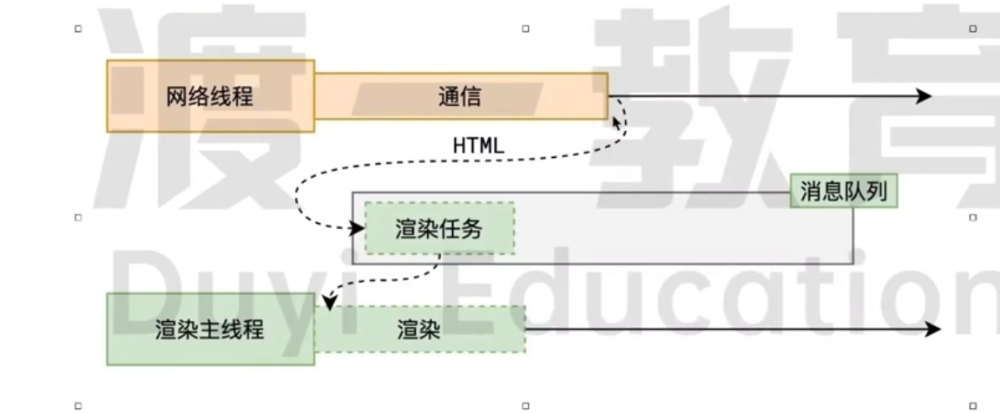
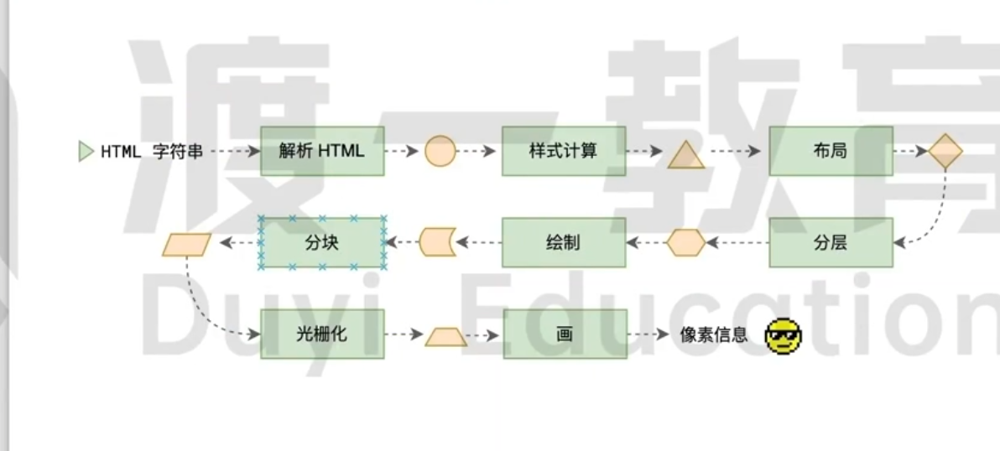
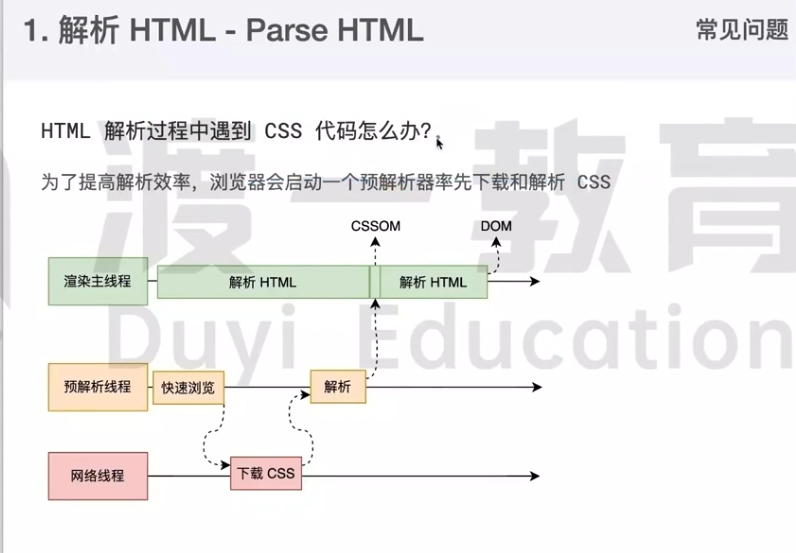
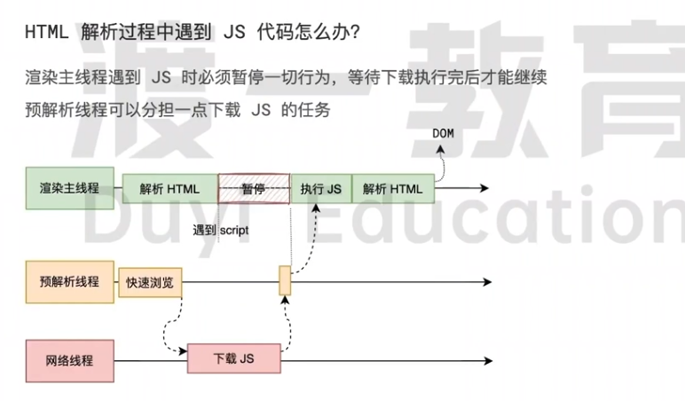
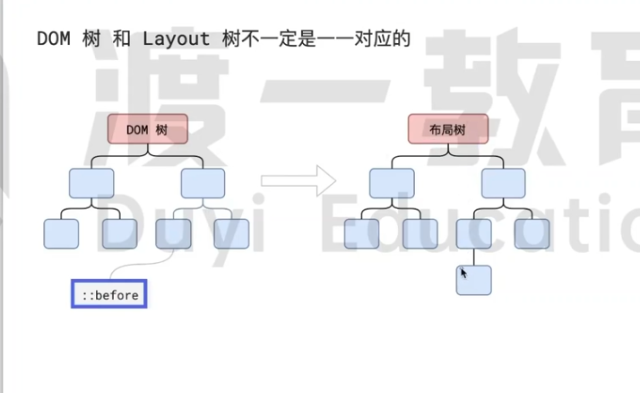
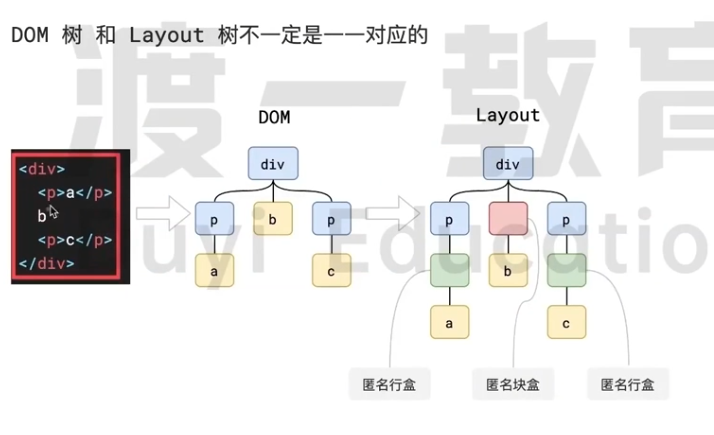
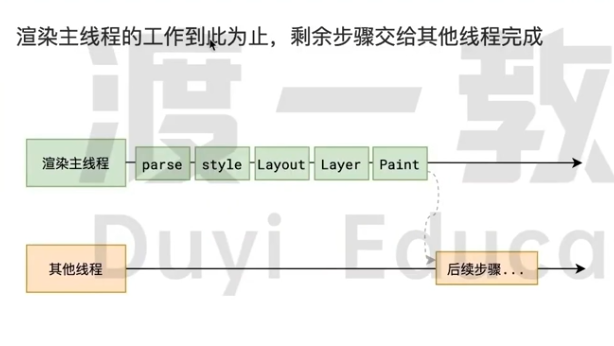
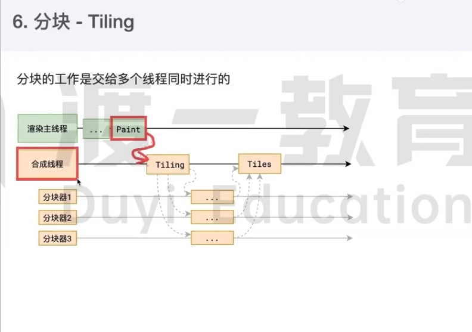
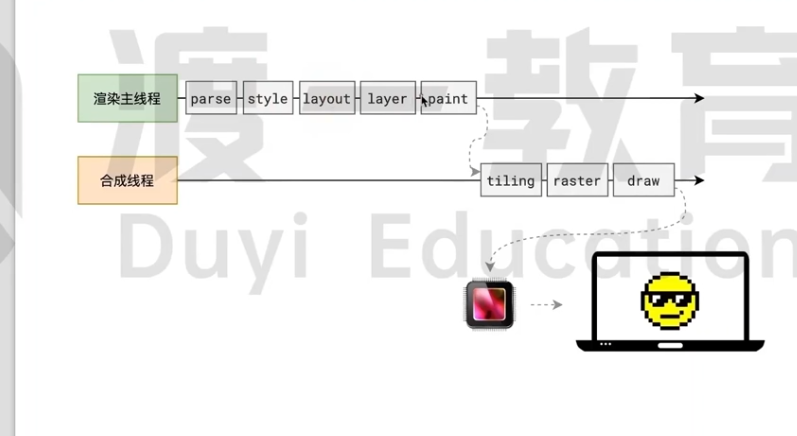

# 浏览器渲染原理

简单点说就是把html字符串变成屏幕点的像素信息（这个过程就是渲染）。

```js
function render(html) {

  return pixels
}

```

## 渲染时间点

浏览器输入地址按下回车键发生什么事情？

重点分为两个部分一个是网络（拿html）一个是渲染



当网络线程收到html文档后会转化成字符串，这是会进行渲染任务，并将其传递主线程的消息队列。在事件循环中，渲染主线程取出渲染任务，开始渲染。

## 渲染流水线



整个渲染分为HTML解析器，JS引擎，CSS解析计算，分层，布局模块，绘制模块，分块，光栅化，画，像素信息。

### 解析 HTML

第一步就是为了方便后续步骤不在操作字符串（是为了给后续的步骤做准备），所以需要构建DOM树。这时候只解析HTML标签，顺便解析内联style标签里的样式，构建DOM树、CSSObjectModel（CSSStyleSheet）

解析过程中遇到 CSS 解析 CSS，遇到 JS 执行 JS。为了提高解析效率，浏览器在开始解析前，会启动一个**预解析的线程**(优化手段)，率先下载 HTML 中的外部 CSS 文件和 外部的 JS 文件。

如果主线程解析到**link**位置，此时外部的 CSS 文件还没有下载解析好，主线程不会等待，继续解析后续的 HTML。这是因为下载和解析 CSS 的工作是在预解析线程中进行的。这就是 CSS 不会阻塞 HTML 解析的根本原因。



如果主线程解析到**script**位置，会停止解析 HTML，转而等待 JS 文件下载好，并将全局代码解析执行完成后，才能继续解析 HTML。这是因为 JS 代码的执行过程可能会修改当前的 DOM 树，所以 DOM 树的生成必须暂停。这就是 JS 会阻塞 HTML 解析的根本原因。



第一步完成后，会得到 DOM 树和 CSSOM 树，浏览器的默认样式、内部样式、外部样式、行内样式均会包含在 CSSOM 树中。

:::warning
HTML解析器是异步解析的，并且不阻塞渲染,如果css 解析时间过长就会导致div显示出来 样式在出来的闪一下问题。当css解析器慢的时候就会出现白屏，解决问题的核心就是的加载速度：可以使用CDN节点进行外部资源加速或者对外部样式文件进行压缩（使用打包工具，例如webpack，gulp，esbuild）优化样式文件，针对js 可以考虑压缩、代码混淆等方式优化，这就是为什么要把script标签放在页面尾部中。
:::

 :::tip

袁老师大师课值得拥有

 :::

### 样式计算

主线程会遍历得到的 DOM 树，依次为树中的每个节点计算出它最终的样式，称之为 Computed Style。

在这一过程中，很多预设值会变成绝对值，比如`red`会变成`rgb(255,0,0)`；相对单位会变成绝对单位，比如`em`会变成`px`

这一步完成后，会得到一棵带有样式的 DOM 树。

::: tip
宽高在这个阶段中有些是能算出来的比如**绝对值**，有些宽高是算不出来的，比如**百分比**、**auto**。
:::

[包含块](include-block)

[CSS属性计算过程](compute-css)

### 布局

布局完成后会得到布局树（布局树是需要找到每一个节点的几何信息，尺寸、位置）。

布局阶段会依次遍历 DOM 树（这个DOM树是计算出样式以后的DOM树）的每一个节点，计算每个节点的几何信息。例如节点的宽高、相对包含块的位置。

大部分时候，DOM 树和布局树并非一一对应。

比如`display:none`的节点没有几何信息，因此不会生成到布局树；又比如使用了**伪元素选择器**，虽然 DOM 树中不存在这些伪元素节点，但它们拥有几何信息，所以会生成到布局树中。还有**匿名行盒**、**匿名块盒**等等都会导致 DOM 树和布局树无法一一对应。


:::tip

1. 内容必须在行盒中，(元素指的是html,行盒块盒指的是css),盒子的类型是由css决定,而不是html，html只提供语义化。
2. 行盒和块盒不能相邻

:::



### 分层

主线程会使用一套复杂的策略对整个布局树中进行分层。（）

分层的好处在于，将来某一个层改变后，仅会对该层进行后续处理，从而提升效率。

滚动条、堆叠上下文、z-index transform、opacity 等样式都会或多或少的影响分层结果，也可以通过`will-change`属性更大程度的影响分层结果。

### 绘制

主线程会为每个层单独产生绘制指令集，用于描述这一层的内容该如何画出来。



### 分块

完成绘制后，主线程将每个图层的绘制信息提交给合成线程，剩余工作将由合成线程完成。合成进程也在渲染进程中，它将图层进行分块，将每个图块交给一个线程来渲染。

合成线程首先对每个图层进行分块，将其划分为更多的小区域。

它会从线程池中拿取多个线程来完成分块工作。

最后得到一个绘制信息



### 光栅化

合成线程会将块信息交给 GPU 进程，以极高的速度完成光栅化。

GPU 进程会开启多个线程来完成光栅化，并且优先处理靠近视口区域的块。

光栅化的结果，就是一块一块的**位图**

### 画

合成线程拿到每个层、每个块的位图后，生成一个个「指引（quad）」信息。

指引会标识出每个位图应该画到屏幕的哪个位置，以及会考虑到旋转、缩放等变形。

变形发生在合成线程，与渲染主线程无关，这就是`transform`效率高的本质原因。

合成线程会把 quad 提交给 GPU 进程，由 GPU 进程产生系统调用，提交给 GPU 硬件，完成最终的屏幕成像。

### 总结

解析HTML首选生成DOM树，CSSOM树,然后计算样式生成具有计算样式后的DOM树（让每一个DOM得到最后的样式）,布局计算出每一个DOM节点的几何信息，布局树和DOM树不一样不能对应。分层，提升后续的效率根据浏览器策略生成对应的图层，每个层面可以进行单独的绘制（z-index transform、opacity）对其影响。生成绘制指令，描述这些东西怎么画,生成指令以后把它给合成线程，然后进行分块，然后对这些块进行光栅化，关栅化后生成quad，位图，然后提交给GPU硬件，完成最终的屏幕成像。


## 问题

## 什么是 reflow？

reflow 的本质就是重新计算 layout 树。

当进行了会影响布局树的操作后，需要重新计算布局树，会引发 layout。

为了避免连续的多次操作导致布局树反复计算，浏览器会合并这些操作，当 JS 代码全部完成后再进行统一计算。所以，改动属性造成的 reflow 是异步完成的。

也同样因为如此，当 JS 获取布局属性时，就可能造成无法获取到最新的布局信息。

浏览器在反复权衡下，最终决定获取属性立即 reflow。

## 什么是 repaint？ （重绘）

repaint 的本质就是重新根据分层信息计算了绘制指令。

当改动了可见样式后，就需要重新计算，会引发 repaint。

由于元素的布局信息也属于**可见样式**，所以 reflow 一定会引起 repaint。

## 为什么 transform 的效率高？

因为 transform 既不会影响布局也不会影响绘制指令，它影响的只是渲染流程的最后一个「draw」阶段

由于 draw 阶段在合成线程中，所以 transform 的变化几乎不会影响渲染主线程。反之，渲染主线程无论如何忙碌，也不会影响 transform 的变化。
