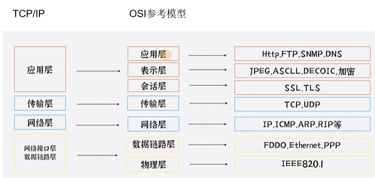
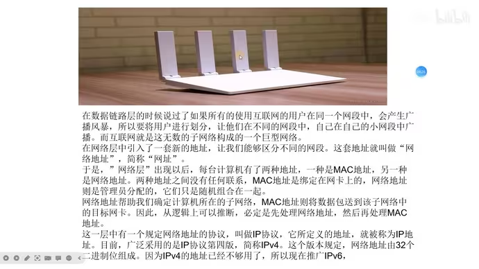

# OSI模型

OSI模型（Open Systems Interconnection Model）是一种通信系统的标准模型，它将计算机网络分为七层，分别为**物理层**、**数据链路层**、**网络层**、**传输层**、**会话层**、**表示层**、***应用层***。

也有人经常将OSI模型简称为TCP/IP模型，同时把它分为四层，分别为**数据链路层**、**网络层**、**传输层**、**应用层**。

## 物理层

物理层是直接和物理介质打交道的层，物理层的设备网卡、网线、集线器、中继器等，最重要的是物理通信，也就是它的信道。

### 有线信道

#### 明线

明线是指平行架设在电线杆上的架空线路。它本身是导电裸线或带绝缘层的导线。虽然它的传输损耗低，但是由于易受天气和环境的影响，对外界噪声干扰比较敏感，已经逐渐被电缆取代

#### 对称电缆

对称电缆是由多对双绞线组成的线缆

#### 同轴电缆

同轴线缆的应用范围极为广泛，同轴电缆能以低损耗的方式传输模拟信号和数字信号，适用于各种应用，其中常见的有电视广播系统、长途电话传输系统、计算机系统之间的短距离跳线以及局域网互联等

#### 光纤

光导纤维是由玻璃或塑料制成的纤维，利用光在这些纤维中以全反射原理传输的光传导工具(全反射现象是光的折射的特殊现象，只有光从光密介质射向光疏介质并且入射角大于等于临界角时全反射 现象才会发生)

### 无线信道

#### 无线电波

以辐射无线电波为传输方式无线信道主要有地波传输，天波传输和视距传输例如:卫星通讯，电台广播、wifi等

### 总结

在这一层通过(**电**，**光**，**无线电波**)，会获取他们对应的**传送信号电压**，转换成010101010101但是数据还未组织，它们的单位为**bit**所以在这一层主要就是**传输比特流**

物理层就是传输比特流的。

## 数据链路层

简单理解 我们在上一层拿到的比特流也就是01010，然后在这一层组装成数据帧。
**数据帧怎么组装的呢**？数据帧通过一个媒介也就是Mac地址组成的

建立逻辑连接、进行硬件地址寻址、差错校验等功能。(由底层网络定义协议)将比特组合成字节进而组合成帧，用MAC地址访问介质，错误发现但不能纠正MAC地址:每个网卡的唯一标识

有了Mac地址之后就可以知道谁是接收者，谁是发送者，并且知道了数据的内容并且进行了分组。那么他如何进行传播数据，他是进行广播的方式进行传输,在局域网内所有的计算机都能收到消息

### 总结

1、数据链路层主要是去拼接数据帧的，有了数据帧并且拼接上Mac地址，就可以进行交互了。
2、交互要使用到交换机（跳点的方式）

## 网络层

网络层主要干两件事情一件是寻地址，另一件是路由。

网络层是最复杂的一层，在这一层就定义了我们的IP，220.xxx.xxx.xxx。该层控制数据链路层与传输层之间的信息转发，建立、维持和终止网络的连接。具体地说，数据链路层的数据在这一层被转换为数据包，然后通过路径选择、分段组合、顺序、进/出路由等控制，将信息从一个网络设备传送到另一个网络设备

1. **寻址**:对网络层而言使用IP地址来唯一标识互联网上的设备，网络层依靠IP地址进行相互通信(类似于数据链路层的MAC地址)

2. **路由**:在同一个网络中的内部通信并不需要网络层设备，仅仅靠数据链路层就可以完成相互通信，对于不同的网络之间相互通信则必须借助路由器等三层设备。

这一层的经常被叫数据包

## 传输层

传输层主要就是定义我们的端口号，以及控流，和校验。并且拥有两个熟知的协议 TCP UDP

TCP是面向连接的协议并且TCP是可靠的因为TCP会进行三次握手四次挥手所以是可靠的，但是这样会降低速度

UDP 具有较好的实时性效率比TCP高UDP是没有三次握手四次挥手的，故此不稳定，但是速度快常用于直播，游戏

这一层经常被叫数据段

## 会话层

会话层，是在发送方和接收方之间进行通信时创建、维持、之后终止或断开连接的地方，与电话通话有点相似。

会话层定义了一种机制，允许发送方和接收方启动或停止请求会话，以及当双方发生拥塞时仍然能保持对话，

会话层包含了一种称为检查点(Checkpoint)的机制来维持可会话。检查点定义了一个最接近成功通信的点，并且定义了当发生内容丢失或损坏时需要
回滚以便恢复丢失或损坏数据的点，即断点下载的原理

## 表示层

表示层主要做了几件重要的事情安全，压缩，也是程序在网络中的一个翻译官。

1. 安全在你的数据发送之前进行加密，在接受者的表示层进行解密。

2. 表示层还会对图片文件等格式进行解码和编码 例如 JPEG、ASCI图片是人类能读懂的计算机需要转换成计算机能读懂的编码

## 应用层

应用层是网络通信的最终目的，它定义了网络通信的各种应用，例如HTTP、DNS、SSH、SMTP等。
