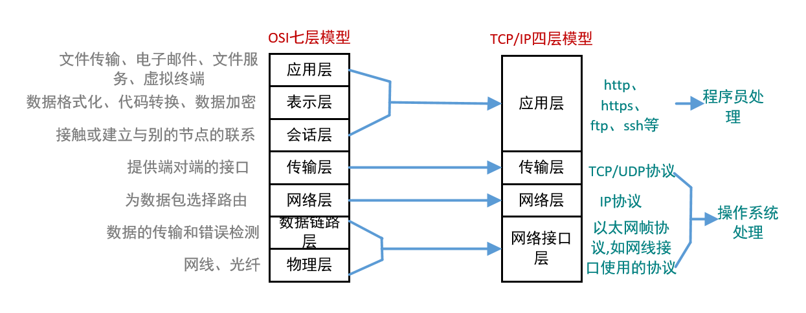
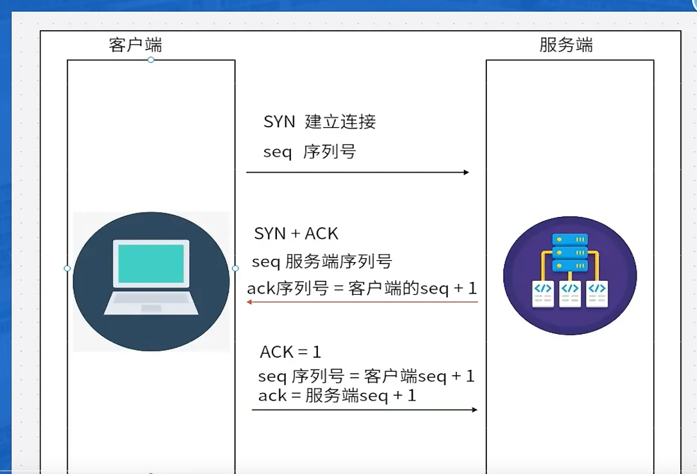

# TCP

TCP (Transmission Control Protocol) 是一种面向连接的、可靠的、基于字节流的传输层协议。通过三次握手建立连接保证三次数据的可靠性和顺序性.以及四次挥手断开连接保证数据完整性。

第一次握手：客户端发送 SYN 包到服务器(表示我想和你建立一个连接，并且指定一个用于数据传输的起始序列号)，并进入 SYN_SEND 状态。

服务端返回一个带有 SYN/ACK 标志位的 ACK 包，表示我知道你想和我连接了，同时接收到了客户端的 SYN 包，并准备好接受数据。表示双方用于传输数据的已经被初始化。

第三次握手:客户端发送一个ack包表示我知道你知道我想和你连接了,并进入 ESTABLISHED 状态。表示连接建立成功。双发开始建立完成。

两次握手会导致什么问题？

1. 服务器端无法确认客户端他能否收到返回过去的ack的，客户端发送SYN请求之后或许是关闭了链接，这样可能会**导致丢包**
2. 客户端无法得知服务端的起始序列号，这样会导致**数据包乱序**。

TCP/IP协议族中，有应用层、传输层、网络层、数据层链路层四层协议。

应用程是http、FTP

传输层的协议有TCP、UDP。

## 三次握手

1. seq(sequence number)，序列号随机生成的
2. ack(acknowledgement number)确认号 ack = seg+1.
3. ACK(acknowledgement)确定序列号有效
4. SYN(synchronous)发起新连接

第一次握手客户端发送一个SYN包到服务器，并且携带一个序列号给到服务端，此时客户端进入SYN_SEND状态。

第二次握手服务端收到SYN包，服务端回去判断一下客户端的序列号是否合法，向客户端返回一个带有SYN+ACK的包，同时返回seq、ack（这时候的ack等于seq+1）这个此时服务端进入SYN_RCVD状态。

第三次握手客户端收到服务端的SYN+ACK包，向服务端发送一个ACK包，（此时客户端的ack等于服务端的seq+1，seq等于客户端的seq+1）确认客户端的序列号有效，此时客户端进入ESTABLISHED状态，服务端也进入ESTABLISHED状态。

## 四次挥手

1. seq(sequence number)，序列号随机生成的
2. ack(acknowledgement number)确认号 ack = seg+1.
3. ACK(acknowledgement)确定序列号有效
4. SYN(synchronous)发起新连接
5. FIN(FINISH)

挥手客户端、服务端都可以发起挥手（关闭连接），但是需要满足以下条件：

