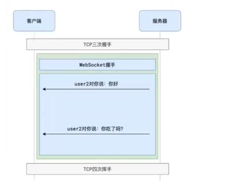

# Websocket

，它是html5以后出现的，从协议上赋予服务器主动推送消息的能力，是一种基于TCP协议的协议，它是一种双向通信的协议，在建立连接之后，服务器和客户端都可以主动发送或接收数据。

tcp握手和微websocke握手的区别(他们不是一个东西)：

* tcp握手：客户端发送一个SYN包到服务器，服务器收到后回复一个SYN/ACK包，然后客户端再发送一个ACK包，三次握手完成。
* websocke握手：客户端发送一个HTTP请求到服务器，服务器收到后回复一个101状态码，然后客户端和服务器建立一个WebSocket连接，完成握手。

* WebSocket也是建立在TCP协议之上的，利用的是TCP全双工通信（客服端、服务端都可以主动发送或接收数据）的能力
* 使用WebSocket，会经历两个阶段:提手阶段、通信阶段

WebSocket是HTML5新增的内容，因此古董版本的浏览器并不支持维持TCP连接需要耗费资源

对于那些消息量少的场景，维持TCP连接确实会造成资源的浪费

:::tip
为了充分利用TCP连接的资源，在使用了WebSockei的页面，可以放弃ajax，都用WebSocket进行通信，当然这会带来程序设计上的一些问题，需要权衡。
:::tip
