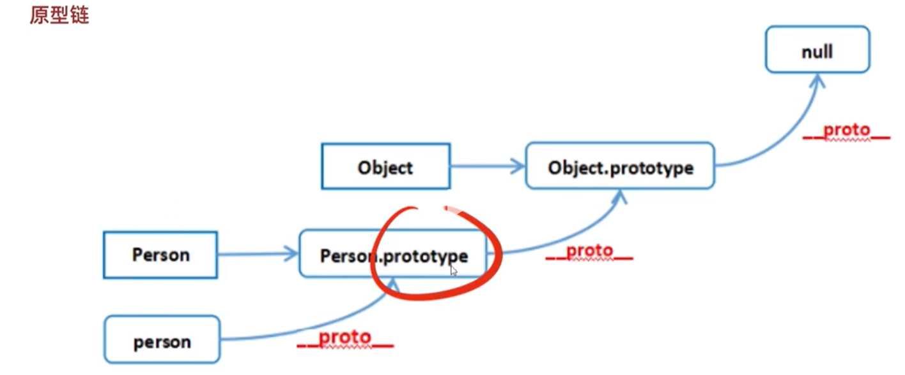

# 原型和原型链

## 什么是原型

其实就是每个函数都有一个名为**prototype**的属性这个属性称为**原型** 因为这个属性是一个对象也称为**原型对象**

```javascript

const array = new Array();
array.push(1)

// new Array => Array.prototype
// 实列array有一个__proto__

Array.prototype === array.__proto__
```

## 什么是原型链

对象都有__proto__属性，这个属性指向它的原型对象，原型对象也是对象，也有__proto__属性，指向原型对象的原型对象，这样一层一层形成的链式结构称为原型链，最顶层找不到就会返回null。


