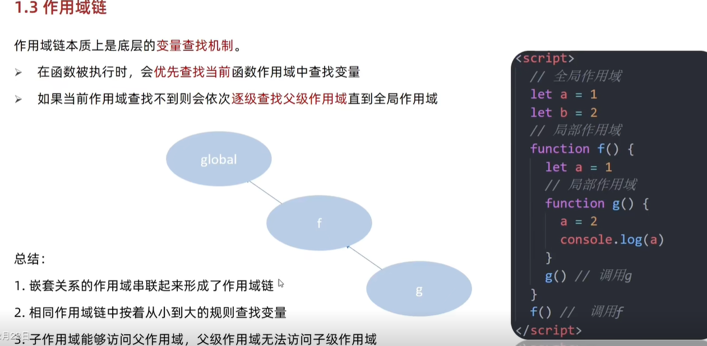

# 作用域/作用域链

## 作用域

作用域(scope)又称为词法作用域，它规定了变量能够被访问的“范围”，离开了这个“范围”变量便不能被访问，

作用域分为三大类：局部作用域、全局作用域

### 局部作用域

局部作用域又分为两种：函数作用域和块作用域

#### 函数作用域

在函数内部声明的变量只能在函数内部访问，函数外部不能直接访问。

1. 函数内部声明的变量，在函数的外部无法访问
2. 函数的参数也是函数内部的局部变量
3. 不同的函数内部声明的变量无法相互访问
4. 函数执行完毕，函数内部的变量也会被销毁

#### 块作用域

使用大括号`{}`包裹的代码称为代码块，在代码块内声明的变量外部【有可能】无法被访问

```javascript
for(lett=1;t<=6;t++){
    //t 只能在该代码块中被访间
    console.log(t)//正常
}
// 超出了 t 的作用域
console.log(t)// 报错
```

1. let 声明的变量会产生块作用域，var不会产生块作用域
2. const 声明的常量也会产生块作用域
3. 不同代码块之间的变量无法互相访问
4. 推荐使用 let 或 const

### 全局作用域

`<script>` 标签 和 .js 文件 的【最外层】就是所谓的全局作用域，在此声明的变量在函数内部也可以被访问全局作用域中声明的变量，任何其它作用域都可以被访问

1. 为 window 对象动态添加的属性默认也是全局的，不雅荐!
2. 函数中未使用任何关键字声明的变量为全局变量，不推荐!!
3. 尽可能少的声明全局变量，防止全局变量被污染

## 作用域链

作用域链本质上是底层的**变量查找机制**。

1. 在函数被执行时，会**优先查找当前**函数作用域中查找变量;
2. 如果当前作用域查找不到则会依次**逐级查找父级作用域**直到全局作用域;
3. 如果全局作用域中也没有找到，则会报错。

作用域链的结构如下图所示：



1. **嵌套关系**的作用域**串联**起来形成了作用域链
2. 相同作用域链中按着从小到大的规则查找变量
3. 子作用域能够访问父作用域，父级作用域无法访问子级作用域

1.作用域链本质是什么?

作用域链本质上是底层的变量查找机制

2.作用域链查找的规则是什么?

会优先查找当前函数作用域中查找变量,查找不到则会依次逐级查找父级作用域直到全局作用域
